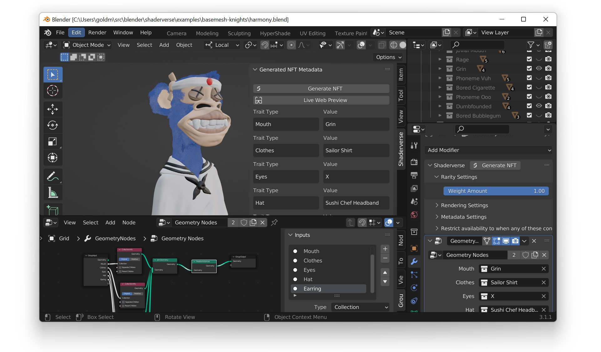

# Shaderverse
## _The NFT Generator for Blender_

   

Shaderverse is an open-source add-on for vistual artists to make 3D NFT collections **without coding**
## Getting Started

- Download the [latest release of Shaderverse](https://github.com/shaderverse/shaderverse/releases/download/v1.0.11.17/shaderverse-1.0.11.17.zip) (Mac / Win / Linux)
- Import the zip file into Blender -> Edit > Preferences > Add-ons > Install
- Import 3D assets (made in any 3D design software) as FBX files (or make 3D assets directly in Blender)
- Use the Blender UI to add new traits, associate 3D assets with traits, and set rarity level for traits
- [Watch our crash course tutorial for detailed instructions](https://twitter.com/shaderverse/status/1508949276675637248?s=20&t=kjYfoS_B9vPkHvDjkkQacw)

## Features

- Generate NFT assets and metadata using the Blender UI
- Use either hand-made meshes or parametrically modeled meshes with Blender Geometry Nodes

## Requirements
- Blender >= 3.1 [[Download Link]](https://www.blender.org/DOWNLOAD/) 

## License

GPL3

**Made with love by [Shaderverse](https://shaderverse.com)**

